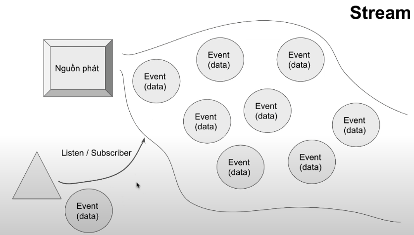
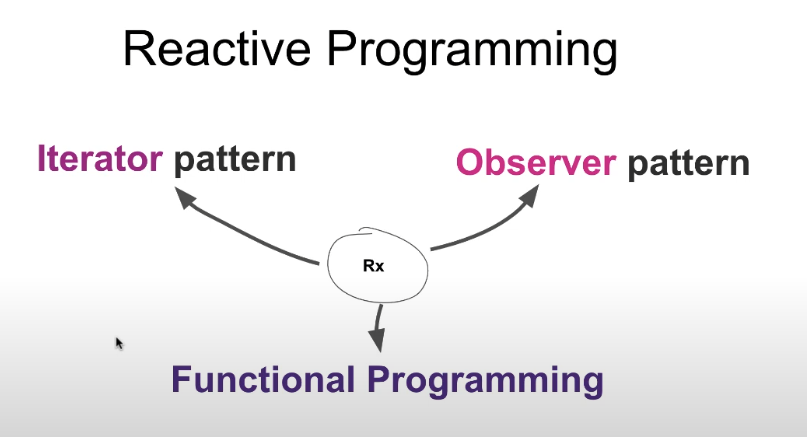

# Giới thiệu Reactive Programming, RxJS và Observable

Khi bạn tìm hiểu về Angular, bạn sẽ thấy rằng nó có phụ thuộc vào một library là RxJS. Có khá nhiều concept trong Angular sử dụng đến RxJS như là Forms, HttpClient, hay như là QueryList, EventEmitter, etc.

Đây vừa là một điểm mạnh, cũng vừa là điểm yếu của Angular. Vì RxJS xử lý asynchronous (không đồng bộ) rất mạnh, nhưng bù lại bạn sẽ phải học thêm một số các concept khác xoay quanh stream. Thinking in streams.

## Reactive Programing
> Là lập trình các luồng sự kiện (event) bất đồng bộ (async)

Một Stream (luồng) gồm nguồn phát tín hiệu sẽ bắn (emit) đi các event có chứa data trong đó và một nơi để lắng nghe, bắt (listen/subscribe) những tín hiệu được emit đi 



Cấu trúc của Reactive programing



## Observable

Trong lập trình đồng bộ thông thường, chúng ta có một kiểu dữ liệu có thể lưu trữ nhiều phần tử đó chính là Array.

Trong thực tế, JS còn có một topic nâng cao nữa là lập trình bất đồng bộ, những thứ như Event, Promise, những thứ mà có thể xảy ra ở bất kỳ thời điểm nào ở trong tương lai mà chúng ta không biết trước.

Chúng ta chỉ có thể gửi cho nó một lời nhắc và khi có sự kiện phát sinh thì chương trình sẽ gọi lại lời nhắc đó cho chúng ta (callback). Callback là một phương pháp để chúng ta thực hiện tương tác lại các task bất đồng bộ. 

Kể cả Promise bạn sẽ vẫn dùng callback để handle `onFulfilled` và `onRejected`. Nhưng hạn chế của Promise là nó chỉ delivery một value duy nhất, nên nó không thể dùng chung cho những thứ có thể delivery nhiều value (ví dụ như DOM event).

Observable tỏa sáng không chỉ bởi vì nó có thể handle nhiều value asynchronous, mà còn vì mặt kiến trúc của nó khi coi mọi thứ là các streams, do đó `data` sẽ được chảy qua các luồng xử lý để có thể biến đổi thành các dạng mà bạn mong muốn ở đầu cuối của stream.

## RxJS core concepts

### Observable
- Observable: đại diện cho ý tưởng về một tập hợp các giá trị hoặc các sự kiện trong tương lai. Khi các giá trị hoặc sự kiện phát sinh trong tương lai, Observable sẽ điều phối nó đến Observer.
- Observable chỉ là một function (class), Nó nhận đầu vào là một Observer và trả về một function để có thể thực hiện việc cancel quá trình xử lý.

### Observer
- Observer là một object chứa một tập 3 callbacks tương ứng cho mỗi loại notification được gửi từ Observable: `next`, `error`, `complete`.
- Observer được cung cấp là tham số đầu vào của subscribe để kích hoạt Observable execution.
```ts
observable.subscribe(observer);
```

### Subscription
- Subscription là một object đại diện cho một nguồn tài nguyên có khả năng hủy được, thông thường trong Rxjs là hủy Observable execution.

### Operators
- Operators là các pure functions cho phép lập trình functional với Observable. 

VD: Chúng ta sẽ tạo ra một hàm có tên là "multiply_2_pure" với mục đích nhân các số đầu vào với 2 và trả kết quả.

Chúng ta thấy rằng, danh sách các số ban đầu không đổi và hàm cũng không tham chiếu đến bất kỳ một biến nào khác ở ngoài phạm vi của hàm. Trường hợp trên được gọi là Pure Functions (Hàm thuần túy). Nghĩa là nội dung hàm sẽ không thay đổi giá trị của đầu vào hoặc bất kỳ dữ liệu nào tồn tại bên ngoài phạm vi của hàm.

```ts
function multiply_2_pure(numArr: number[]) {
  let result = []
  numArr.forEach(num => {
    result.push(num*2)
  });
  return result
}
```

### Subject
- Subject để thực hiện việc gửi dữ liệu đến nhiều Observers (multicasting).

### Schedulers
- Một scheduler sẽ điều khiển khi nào một subscription bắt đầu thực thi, và khi nào sẽ gửi tín hiệu đi.

## Working with Observables

### Creating Observables

Để create một Observable chúng ta chỉ cần gọi constructor và truyền vào một function (gọi là **subscribe**), trong đó **subscribe function** sẽ nhận đầu vào là một Observer.

```ts
const observable = new Observable(function subscribe(observer) {
  const id = setTimeout(() => {
    observer.next('Hello Rxjs');
    observer.complete();
  }, 1000);
});
```

Để có thể clean up chúng ta sẽ return về một function trong **subscribe function** như sau:

```ts
const observable = new Observable(function subscribe(observer) {
  const id = setTimeout(() => {
    observer.next('Hello Rxjs');
    observer.complete();
  }, 1000);
  return function unsubscribe() {
    clearTimeout(id);
  }
});
```

### Invoking Observable
Các Observable hầu hết sẽ giống như một function, tức là nếu bạn có một Observable thì nó chỉ như khai báo một function, do đó những gì bên trong function sẽ không được chạy cho đến khi bạn invoke function đó (lazy computation).

Để invoke một Observable bạn chỉ cần `subscribe` vào nó là được. Và sau khi subscribe thì nó sẽ trả về một Subscription.

```ts5
const subscription = observable.subscribe({
  next: (value) => {
    console.log(value);
  },
  error: (error) => {
    console.log(error);
  },
  complete: () => {
    console.log('Done');
  }
});
```

### Executing Observables

Phần code khi chúng ta KHỞI TẠO Observable `new Observable(function subscribe(observer) {...})` chính là “Observable execution”.

Sau khi chúng ta invoke một Observable thì nó bắt đầu chạy, và khi có một signal (dấu hiệu) nào (`next`, `error`, `complete`) gửi đi thì những gì chúng ta cung cấp cho Observer phía trên sẽ được gọi để tương tác lại tín hiệu đó.

Có ba kiểu giá trị mà một Observable Execution có thể gửi đi:
- "next" notification: gửi đi một giá trị, có thể là bất kỳ kiểu dữ liệu nào như Number, a String, an Object, etc.
- "error" notification: gửi đi một JavaScript Error hoặc exception.
- "complete" notification: không gửi đi một giá trị nào, nhưng nó gửi đi một tín hiệu để báo rằng stream này đã completed, mục đích để Observer có thể thực hiện một hành động nào đó khi stream completed.

Next notifications thường được sử dụng rộng rãi, nó cực kỳ quan trọng, vì nó gửi đi dữ liệu cần thiết cho một Observer.

Error và Complete notifications có thể chỉ xảy ra duy nhất một lần trong một Observable Execution. 

> Lưu ý rằng, chỉ có 1 trong 2 loại tín hiệu trên được gửi đi, nếu đã complete thì không có error, nếu có error thì không có complete. (Chúng không thuộc về nhau :D). Và nếu đã gửi đi complete, hoặc error signal, thì sau đó không có dữ liệu nào được gửi đi nữa. Tức là stream đã close.

### Disposing Observable Executions

Observable có cơ chế cho phép chúng ta hủy việc thực thi. Đó là khi subscribe được gọi, một Observer sẽ bị gắn với một *Observable execution* mới được tạo, sau đó nó sẽ trả về một object thuộc type Subscription. Kiểu dữ liệu này có một method `unsubscribe` khi chúng ta gọi đến, nó sẽ thực hiện cơ chế để hủy việc thực thi.

> Lưu ý: nếu bạn tự tạo Observable (bằng new Observable chẳng hạn) thì bạn phải tự thiết lập cơ chế để hủy.
