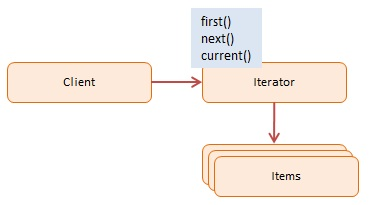

# Iterator Pattern

> Iterator pattern cho phép người dùng lặp qua một tập hợp các đối tượng một cách hiệu quả.

## Using Iterator

Điểm chung của lập trình thông thường là duyệt và thao tác một tập hợp các đối tượng. Các collections này có thể được lưu trữ dưới dạng một mảng hoặc có thể là một cái gì đó phức tạp hơn, chẳng hạn như cấu trúc cây hoặc đồ thị.
Ngoài ra, bạn có thể cần phải truy cập các items trong collection theo một thứ tự nhất định, chẳng hạn như trước ra sau, sau ra trước, độ sâu trước (như trong tìm kiếm trên cây), bỏ qua các đối tượng được đánh số đều, v.v.

Iterator pattern giải quyết vấn đề này bằng cách tách tập hợp các đối tượng khỏi việc truyền tải các đối tượng này bằng cách triển khai một trình lặp chuyên dụng.

Ngày nay, nhiều ngôn ngữ đã tích hợp sẵn Iterators bằng cách hỗ trợ các cấu trúc kiểu 'for-each' và giao diện IEnumerable và IEnumerator. Tuy nhiên, JavaScript chỉ hỗ trợ lặp cơ bản dưới dạng câu lệnh for, for-in, while và do while.

Iterator pattern cho phép các nhà phát triển JavaScript thiết kế các cấu trúc lặp linh hoạt và phức tạp hơn nhiều.

## Participants

Các đối tượng tham gia vào mô hình này là:

- Client (the run() function in example code)
  + Tham chiếu và gọi Iterator với collections các đối tượng

- Iterator (Iterator in example code)
  + Triển khai interface với các phương thức first(), next(), etc
  + Theo dõi vị trí hiện tại khi duyệt qua collection

- Items (Items in example code)
  + Các đối tượng riêng lẻ của collection đang được duyệt qua